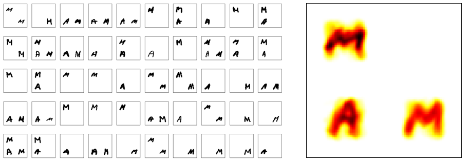
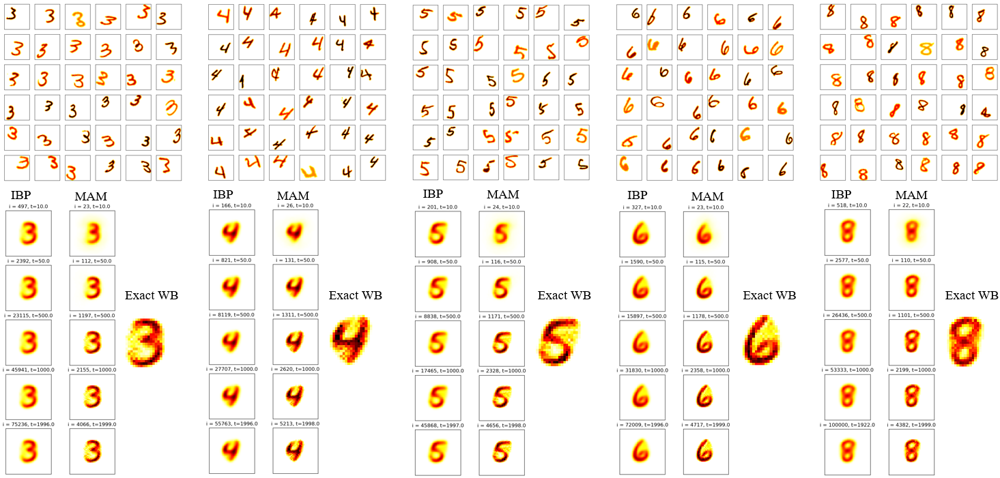

# 🔷 Method of Averaged Marginals (MAM)

**Exact Wasserstein Barycenter via Douglas–Rachford Splitting / Averaged Marginals**  
*Mimouni, Malisani, Zhu & de Oliveira — SIAM J. Math. Data Sci., 2024*

This repository contains a clean, modular implementation of the **Method of Averaged Marginals (MAM)** to compute **exact (unregularized)** Wasserstein barycenters of discrete probability distributions. It supports both **balanced** and **unbalanced** variants by formulating the problem as a **monotone inclusion** solved via **Douglas–Rachford splitting**.

MAM interprets each step as an **averaging of projected marginals**, which leads to highly parallelizable, scalable computations suitable for large datasets.

<p align="center">
  
</p>

---

## 🚀 Highlights

- **Exact solution** of the linear (non-entropic) Wasserstein barycenter problem
- Supports both **balanced** and **unbalanced** (mass creation/destruction) OT
- Based on **Douglas–Rachford operator splitting**
- Each iteration involves simple, exact projections (e.g., simplex projections)
- Interpretable as an **averaged marginal projection method**
- Fully **parallelizable** (MPI), highly scalable
- State-of-the-art convergence properties (faster and more stable than Sinkhorn)

---

## 📦 Installation

```bash
git clone https://github.com/dan-mim/MAM.git
cd MAM
pip install -r requirements.txt
```

> You may also want to set up a dedicated environment using Conda:
> ```bash
> conda create -n mam python=3.10
> conda activate mam
> pip install -r requirements.txt
> ```

---
## 📁 Repository Structure

```
/
├── mam/                      # Core MAM package
├── toy_example/              # Simple usage demos
├── free_support_ellipse/     # Free support setting: experiment from Section 6.3 of the paper
├── unbalanced/               # Unbalanced setting: experiments with non-matching total mass
├── figures/                  
├── LICENSE
└── README.md
```

---


## ⚙️ Running MAM in Parallel

The MAM algorithm is implemented to run in **parallel using MPI**, enabling efficient computation on large datasets. It distributes the input distributions across multiple processes to parallelize marginal projections and speed up convergence.

To run MAM, use `mpiexec` (or `mpirun`) and specify the number of processes (typically the number of CPU cores you want to use):

```bash
mpiexec -n 4 python your_script.py
```

For example, to run the main MAM computation on a dataset with 4 parallel workers:

```bash
cd toy_example
mpiexec -n 4 python demo.py
```

> 🔁 You can change `-n 4` to any number of available cores on your machine or computing cluster.

> ⚠️ Make sure `mpi4py` is installed in your environment:
> ```bash
> pip install mpi4py
> ```

---  


## 📘 Citation

If you use this code or reproduce the results, please cite:

```bibtex
@article{mimouni2024computing,
  title={Computing Wasserstein Barycenter via Operator Splitting: The Method of Averaged Marginals},
  author={Mimouni, Daniel and Malisani, Paul and Zhu, Jiamin and de Oliveira, Welington},
  journal={SIAM Journal on Mathematics of Data Science},
  volume={6},
  number={4},
  pages={1000--1026},
  year={2024},
  doi={10.1137/23M1584228}
}
```
---

## 🚀 Comparison with state of the art methods

MAM has been compared to IBP, a widely adopted state-of-the-art method known for its simplicity and practical accuracy. However, as demonstrated in the article, when high-precision results are required, our proposed exact method offers significantly better performance and reliability.

<p align="center">
  
</p>

---

For usage instructions, experiments and visualizations, please refer to the folders:
- `toy_example/` for basic demos
- `free_support_ellipse/` for geometric barycenters (Fig. 6.3)
- `unbalanced/` for unbalanced OT settings (Figs. 8 & 9)
