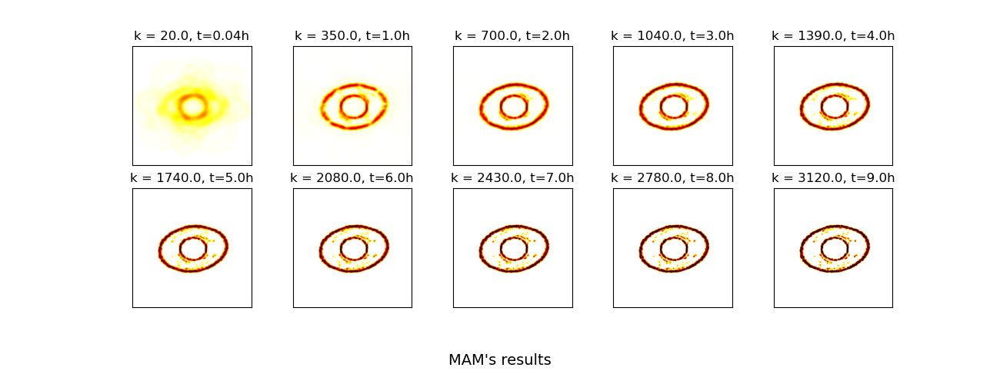
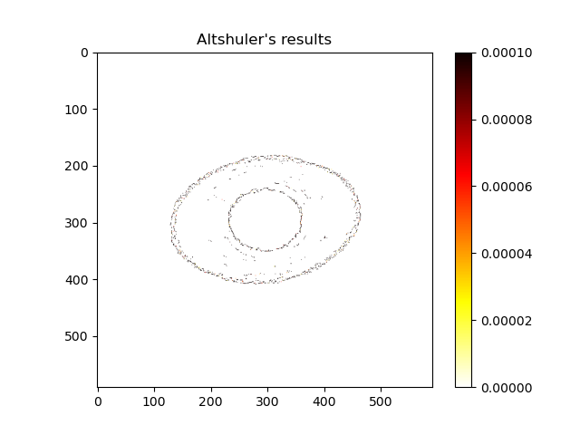
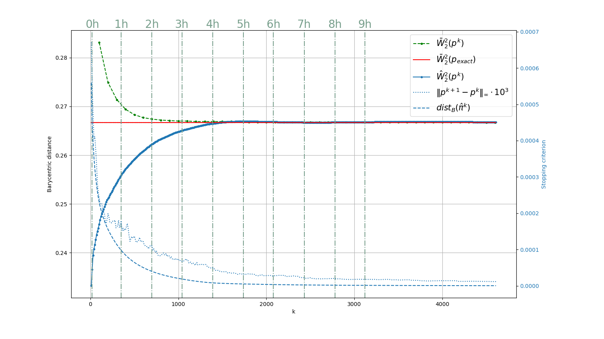

# Ellipse Dataset – Reproducing Section 6.3 of the MAM Paper

This folder allows you to **reproduce the results from Section 6.3** of the paper:  
**"Computing Wasserstein Barycenter via Operator Splitting: The Method of Averaged Marginals" (Mimouni et al., 2024)**.

<p align="center">
  
</p>


---

## 📁 Contents

- `dataset/dataset_altschuler.pkl`  
  Adapted from the original dataset by Altschuler et al. dataset/input_ellipse_data_coordinates.pkl
  Geometry has been preprocessed to be directly compatible with the MAM algorithm.

- `draw_ellipse_sol.py`  
  Utility script to visualize input distributions and barycenters.

- `execute_MAM.py`  
  Script to recompute the MAM barycenter from the ellipse dataset.

- `visualize_results.py`  
  Plot the final results as shown in **Figure 6 & 7** of the article.

---

## 📂 Output Folders

- `outputs_altschuler/`  
  Contains barycenter results computed using the method from Altschuler et al.

<p align="center">
  
</p>


- `outputs_mam/`  
  Contains barycenter results computed using the proposed **MAM** method.
This folder also gives more insight about the stopping criteria and MAM convergence
<p align="center">
  
</p>

---

## ▶️ How to Run

1. **Visualize input dataset or barycenter:**
   ```bash
   python draw_ellipse_sol.py
   
2. **Recompute MAM barycenter:**
    ```bash
    mpiexec -n 4 python execute_MAM.py
   
3. **Visualize final paper result:**
    ```bash
    python visualize_results.py