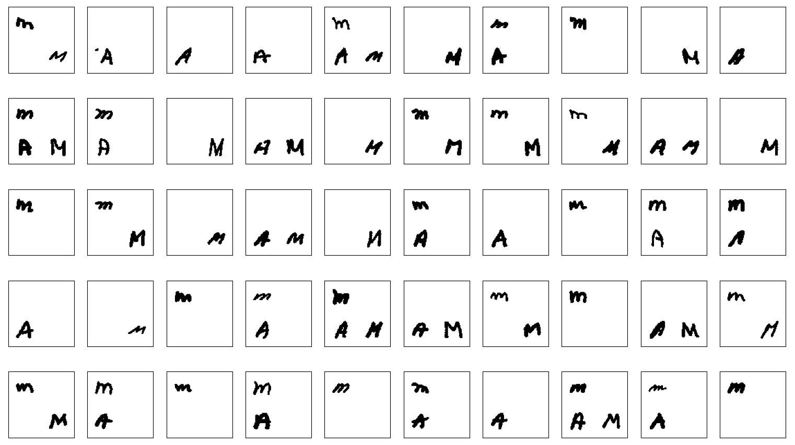
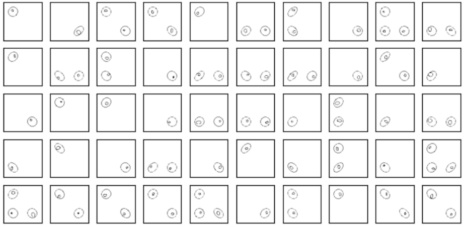
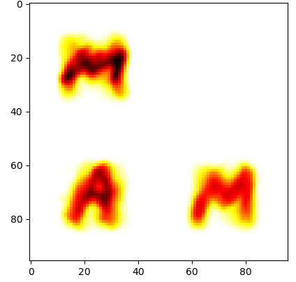
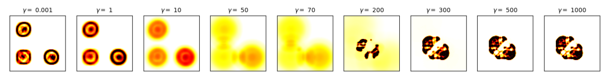

# Unbalanced Wasserstein Barycenters – MAM

This folder demonstrates the use of the **Method of Averaged Marginals (MAM)** in the **unbalanced optimal transport setting**, as presented in:

**Mimouni, D., et al. (2024)**  
*Computing Wasserstein Barycenter via Operator Splitting: The Method of Averaged Marginals*  
SIAM Journal on Mathematics of Data Science, 2024.

---

## 📁 Contents

### 🔹 Datasets

- `dataset_letters/`  
  Contains the discrete input distributions used to generate **Figure 7 (top row)** of the article.  
  These correspond to stylized letter shapes.  
  The original inputs are stored in:
  


- `dataset_nested_ellipses/`  
  Contains datasets used to reproduce **Figures 8 and 9** of the article (nested geometric distributions).  
  Useful to explore the unbalanced barycenter effect on more abstract shapes.
  

---

### 🔹 Figures

- `figures/MAM_dataset.png`  
  Displays the **initial distributions** used as input for the unbalanced barycenter computation.

- `figures/res_MAM_upper_1000s.png`  
  Shows the **resulting barycenter** after 1000 iterations with a moderate value of the unbalanced parameter `gamma`.

---

## ▶️ How to Run

Use the script `execute_MAM.py` to launch the computation of unbalanced barycenters.  
You can modify the `gamma` parameter to observe how the result changes with varying degrees of unbalance.

### Example:
```bash
mpiexec -n 4 python execute_MAM.py
```
# Running Unbalanced MAM: Parameters and Interpretation

This guide explains how to run the **Method of Averaged Marginals (MAM)** in the **unbalanced barycenter setting**, and how to interpret the key visual results from the paper.

---

## 🔧 Parameters You Can Adjust

When launching `execute_MAM.py`, you can configure:

### `--gamma`  
Controls the **relaxation of the mass constraint**:
- `--gamma 0` → classical **balanced** barycenter (mass must match across input distributions)
- `--gamma 0.05`, `--gamma 1`, `--gamma 100`, `--gamma 1000` → increasing levels of **mass flexibility**  
  → allows the algorithm to **create or destroy mass**, leading to more shape-aware barycenters


---
# Interpretation of Figures – Unbalanced MAM Results

This document provides visual interpretations and analysis of the figures obtained by running the **Method of Averaged Marginals (MAM)** in the **unbalanced optimal transport** setting.

---

### Key Characteristics:
- Shapes correspond to stylized letters
- Varying brightness → different total mass across distributions
- Classic balanced barycenter computation would force **mass conservation**, which may distort geometry

---

## 🔹 Output Barycenter (Unbalanced, 1000 iterations)

After 1000 iterations of MAM with `gamma > 0`, we obtain:




You should be able to evaluate the impact of gamma like in Figure 9 of the article.


### Interpretation:
- The barycenter is computed using **unbalanced optimal transport**
- The parameter `gamma` controls how strictly mass conservation is enforced:
  - A small `gamma` allows **some flexibility**
  - A large `gamma` tolerates **more mass variation** between source and barycenter
- The resulting shape:
  - Preserves visual features of input distributions
  - Avoids the "washed out" effect typical in balanced averaging
  - Captures structure better, especially in sparse or non-overlapping regions

---

## 💡 Takeaway

Using an **unbalanced approach** is particularly useful when:
- The input distributions differ significantly in total mass
- Preserving structure or sharpness is more important than strict mass conservation
- You want to interpolate across measures with **different supports**

This result highlights the **flexibility and robustness** of MAM in real-world settings where perfect mass alignment is not guaranteed.

---

## 📘 Reference

To understand the underlying method and its theoretical justification, please refer to:

```bibtex
@article{mimouni2024computing,
  title={Computing Wasserstein Barycenter via Operator Splitting: The Method of Averaged Marginals},
  author={Mimouni, Daniel and Malisani, Paul and Zhu, Jiamin and de Oliveira, Welington},
  journal={SIAM Journal on Mathematics of Data Science},
  volume={6},
  number={4},
  pages={1000--1026},
  year={2024},
  doi={10.1137/23M1584228}
}
